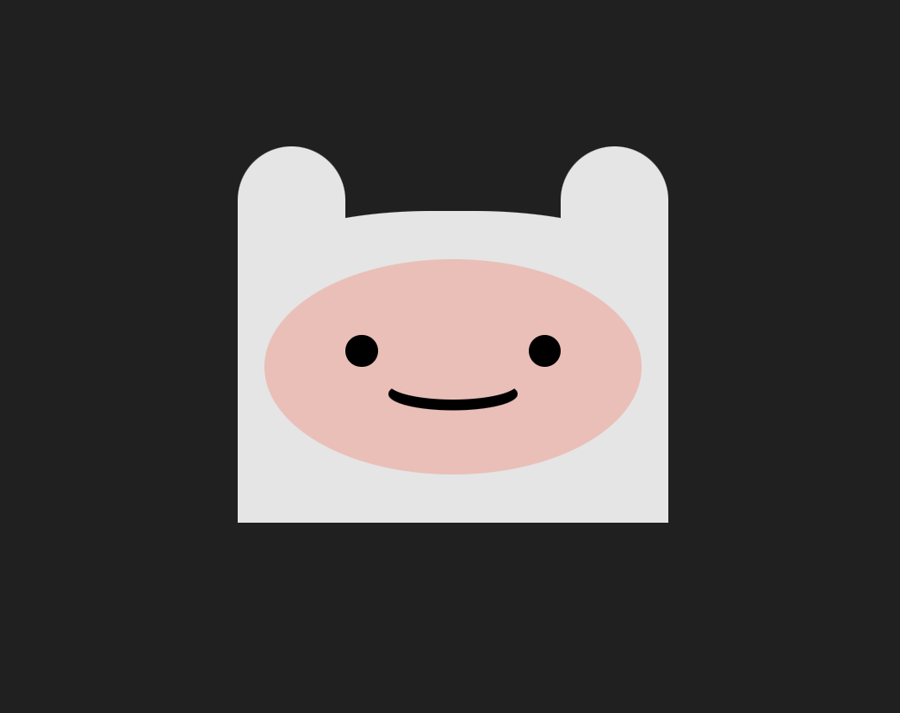

# Finn Hora de Aventura

Desenho com CSS

## Readme Contents:
- [Summary](#summary)
  - [About the project](#about)
  - [Screenshot](#screenshot)
- [My codes](#code)
  - [HTML](#html)
  - [CSS](#css)
- [Process](#process)
  - [designed](#designed)
  - [learned](#learned)
- [Autor](#autor)

## Summary

### about

Desenho feito atraves do CSS

### screenshot

## My codes

### Html

Code HTML

### css

Code CSS

## process

### designed

- Design CSS;
- Semantic HTML;
- Heroes CSS.

### learned

🟢 CSS design.

### autor

